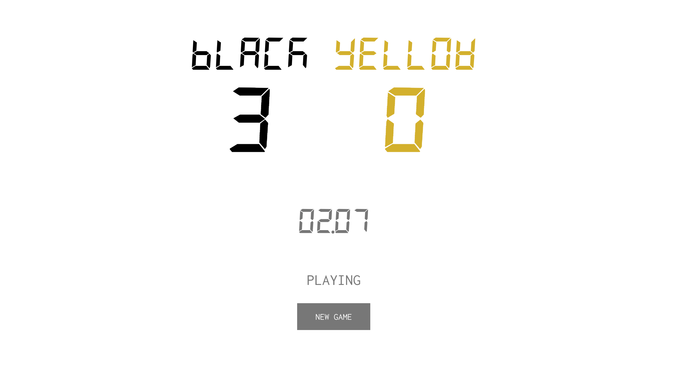

# Foosball scoreboard demo

[](https://travis-ci.org/IQ-Inc/foosball-scoreboard-demo)

First prototype of a foosball scoreboard, written in Clojure and ClojureScript.



## Requirements

- Java 1.8+
- A serial device (ex. Arduino)
- Tested on Chrome and Firefox

## Getting started

Download the latest release from GitHub. From the command line, run

```bash
$ java -jar foosball-scoreboard.jar /dev/[your-serial-device] 115200
```

The command line arguments, in order, are the serial device and the serial
device baud rate. The program starts a webserver and app accessible at
`localhost:3000`. The server monitors the serial connection for foosball events,
and updates will be pushed to all connected clients.

## Serial events

The server will handle any serial message that is suffixed with a newline (ASCII
`10`). The server expects the following serial events to correspond to specific
foosball events:

| ASCII `char`          |    Foosball Event    |
| --------------------- | -------------------- |
|  `'BD'`               | Black ball drop      |
|  `'GD'`               | Gold ball drop       |
|  `'BG'`               | Black scores a goal  |
|  `'GG'`               | Gold scores a goal   |

The codes are configurable in the Clojure `foosball-score.events` namespace.

## Developing

- Clojure 1.8+
- Leiningen, min 2.5.0

Install both, clone the project, and you're ready to go.The frontend may be
interactively developed (port 3449) using figwheel:

```bash
lein figwheel
```

To test the backend and websockets, the server will need to be run
independently (port 3000):

```bash
lein run # Can also use 'lein repl', and start the server with (start-server)
```