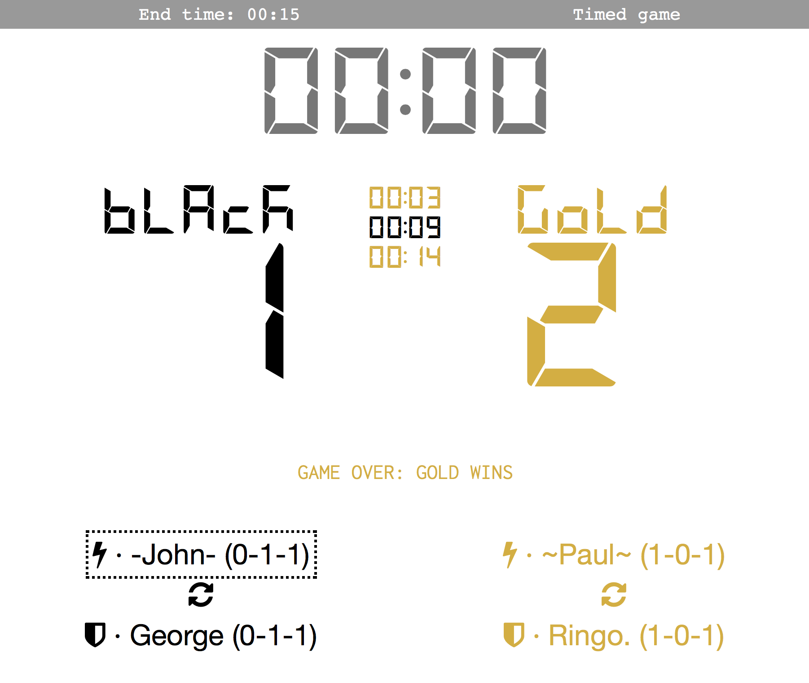

# Foosball scoreboard demo

First prototype of a foosball scoreboard, written in Clojure and ClojureScript.



## Requirements

- Java 1.8+
- A serial device (ex. Arduino)
- Tested on Chrome. Safari definitely does not show the cool segment font...

## Getting started

Download the latest release from GitHub. From the command line, run

```bash
$ java -jar foosball-scoreboard.jar /dev/[your-serial-device] 115200
```

The command line arguments, in order, are the serial device and the serial
device baud rate. The program starts a webserver and app accessible at
`localhost:3000`. The server monitors the serial connection for foosball events,
and updates will be pushed to all connected clients.

## Serial events

The server expects the following serial events to correspond to specific
foosball events:

| ASCII `char` (`code`) |    Foosball Event    |
| --------------------- | -------------------- |
|  `'0'` (`48`)         | Black ball drop      |
|  `'1'` (`49`)         | Yellow ball drop     |
|  `'2'` (`50`)         | Black scores a goal  |
|  `'3'` (`51`)         | Yellow scores a goal |

The codes are configurable in the `foosball-score.serial` namespace.

## Developing

- Clojure 1.8+
- Leiningen, min 2.5.0

Install both, clone the project, and you're ready to go.The frontend may be
interactively developed (port 3449) using figwheel:

```bash
lein figwheel
```

To test the backend and websockets, the server will need to be run
independently (port 3000):

```bash
lein run # Can also use 'lein repl', and start the server with (start-server)
```